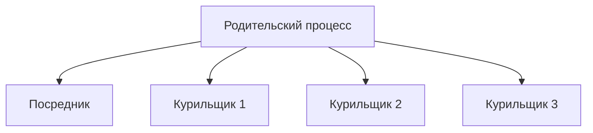
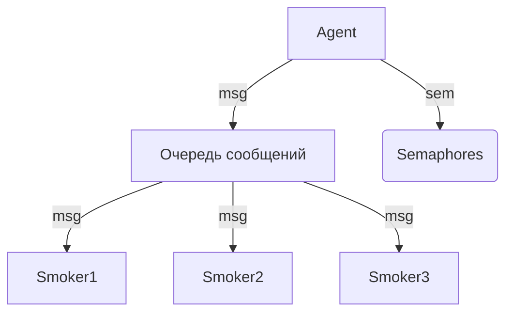
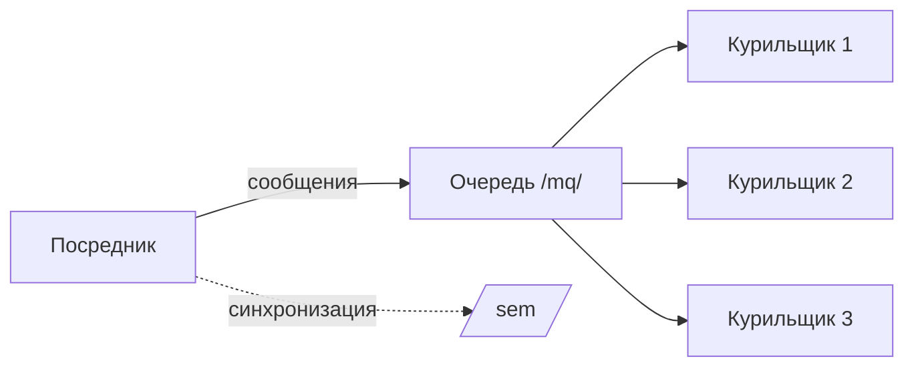

# osi_hw2
# Отчет по ИДЗ 2 вариант 10

## Исполнитель
Малова Олеся Андреевна, группа БПИ238

## Отчет для 4-5 баллов

### Моделирование процессов

### Механизм синхронизации
1. **Именованные POSIX семафоры**:
   - `mutex` - контроль доступа к разделяемой памяти
   - `mediator` - сигнал для посредника
   - `smokerX` - по одному на каждого курильщика

2. **Разделяемая память POSIX**:
   - Хранит текущие компоненты на столе
   - Содержит флаги состояния курильщиков

---

## Отчет для 6-7 баллов

### Улучшения по сравнению с 4-5 баллами
1. Использование **неименованных POSIX семафоров**
2. Более надежная синхронизация вывода
3. Улучшенная обработка ошибок

### Особенности реализации
- Семафоры размещены в разделяемой памяти
- Добавлен отдельный семафор для синхронизации вывода
- Использование `std::cout` с мьютексом

---

## Отчет для 8 баллов

### Основные особенности
1. **Независимые процессы** (запускаются отдельно)
2. **System V IPC**:
   - Очереди сообщений для передачи компонентов
   - Семафоры для синхронизации
3. Динамическое управление ресурсами

### Схема взаимодействия

---

## Отчет для 9 баллов

### Условие задачи
Максимально сложная версия с использованием дополнительных механизмов IPC.

### Технологии
- POSIX/System V семафоры
- Очереди сообщений POSIX/System V
- UNIX domain sockets (альтернатива для MacOS)

### Особенности реализации
1. Полностью независимые процессы
2. Использование очередей сообщений для коммуникации
3. Кросс-платформенное решение (работает на MacOS и Linux)
4. Универсальная программа для курильщиков

### Результаты тестирования
- Успешный обмен сообщениями между процессами
- Корректная работа на разных платформах
- Устойчивость к прерываниям
- Полное освобождение ресурсов

---

## Отчет для 10 баллов

### Вариант реализации
Для достижения максимальной оценки реализована альтернативная версия с использованием:
- **Именованных POSIX семафоров**
- **POSIX очередей сообщений**
- **Независимых процессов**

## Архитектура системы

